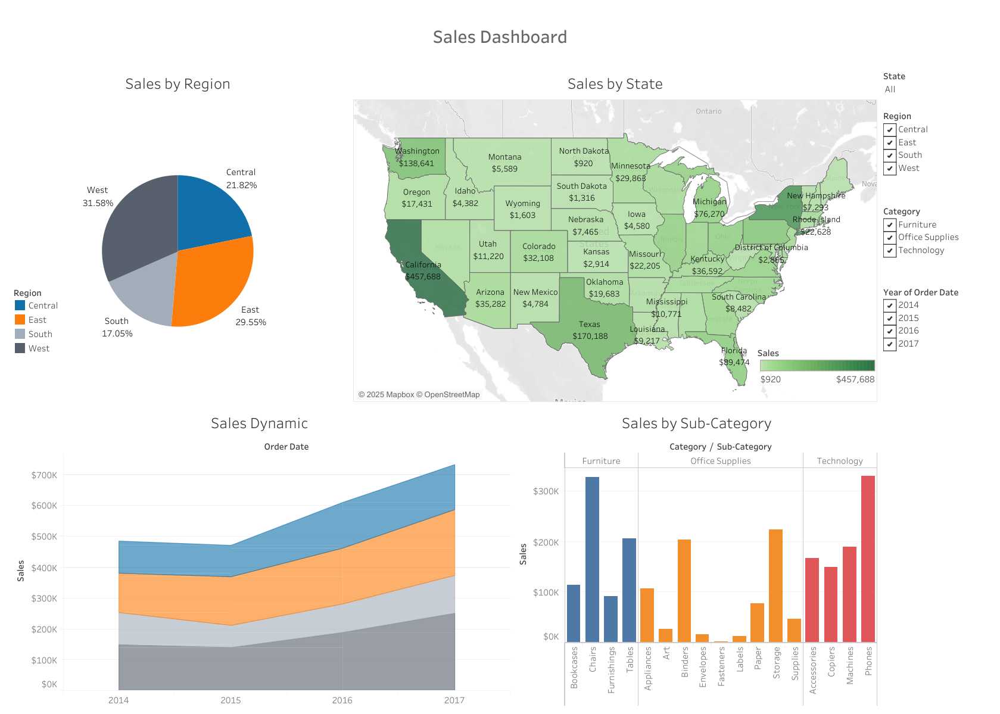

# Comprehensive Sales Analytics Dashboard

🔗 **Live Dashboard on Tableau Public**: [Click here to explore](https://public.tableau.com/app/profile/tetiana.dynys/viz/SalesDashboard_17399900631840/SalesDashboard)

---

## Overview

This interactive Tableau dashboard provides a **comprehensive view of sales performance** across different **regions, states, and product categories** over time.  
It's designed to help users **analyze key sales metrics**, detect **long-term trends**, and gain **data-driven insights** for strategic decisions.

---

## Dashboard Components

### Pie Chart – Sales by Region  
Displays the distribution of sales across four major U.S. regions: **Central**, **East**, **South**, and **West**.  
This visualization allows for a quick regional comparison of sales performance.

### Map – Sales by U.S. States  
A geographical map that visualizes state-level sales data across the United States.  
It enables users to **spot regional sales trends** and identify high- or low-performing areas.

### Area Chart – Sales Dynamics (2014–2017)  
Tracks the evolution of sales from **2014 to 2017**, offering a clear look at annual performance shifts and **long-term sales trends**.

### Bar Chart – Sales by Sub-Category  
Breaks down sales by product lines: **Furniture**, **Office Supplies**, and **Technology**.  
This component supports **informed decisions** around inventory, product focus, and marketing efforts.

---

## Key Insights

- The **West region** recorded the **highest total sales**, with **California** standing out as the top-performing state.
- **Sales increased steadily in 2017**, with the **Central region** showing the most significant growth compared to previous years.
- **Top-performing sub-categories** in each product category:
  - **Furniture**: *Chairs*
  - **Office Supplies**: *Storage*
  - **Technology**: *Phones*
- Regional and sub-category breakdowns allow users to identify high-performing markets and product opportunities.
- The dashboard enables quick comparisons across regions, states, and categories for data-driven decision-making.

---

## Tools & Technologies

- **Tableau** – for interactive data visualization.

---

## How to Use

1. Visit the [Tableau Public dashboard](https://public.tableau.com/app/profile/tetiana.dynys/viz/SalesDashboard_17399900631840/SalesDashboard).
2. Interact with filters and charts to explore data across different dimensions.

---
